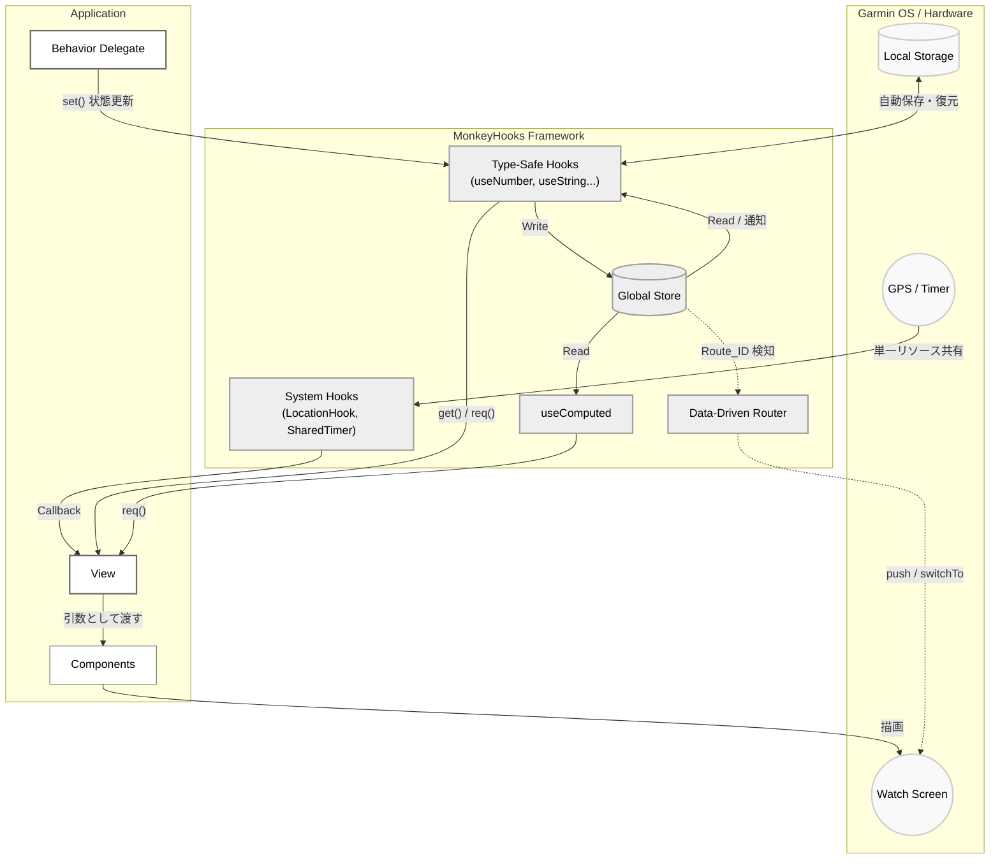

# MonkeyHooks

MonkeyHooksは、Garmin Connect IQ (Monkey C) アプリケーション開発向けの、状態管理とユーティリティを提供するライブラリです。

UIの状態管理、システムリソース（タイマーやGPS）の共有、および画面遷移などの処理を整理し、保守性を高める目的で設計されています。


## 採用事例: YAMAKAGE

Garmin向けアプリケーション「YAMAKAGE」は、MonkeyHooksの実用例の一つです。

[YAMAKAGE(リポジトリ)](https://github.com/tomopumipumi/yamakage)
[YAMAKAGE(Connect IQ)](https://apps.garmin.com/ja-JP/apps/48e48601-9506-4f67-b19c-59ca702c34b8?tid=2)


Garminデバイスの厳しいCPU・メモリ制約下において、太陽や月の軌道計算、パノラマビュー、アニメーションといった複雑なUIを実装する場合、通常は「パフォーマンスの確保」と「コードの保守性」の両立が大きな課題となります。

YAMAKAGEでは、MonkeyHooksの状態管理とキャッシュ機構を活用することで、複雑になりがちな状態遷移やデータフローを整理して保守性を高めつつ、滑らかな描画や低消費電力といった実用的なパフォーマンスを実現しています。

---

## 基本設計

MonkeyHooksは、以下のパラダイムに基づいて設計されています。

1. **状態の一元管理:**
アプリ全体で共有される単一の `Store` を持ちます。状態はキーによって管理され、任意のコンポーネントからアクセスおよび更新が可能です。
2. **自動的な描画更新:**
状態が `set()` によって更新されると、変更を検知して自動的に `WatchUi.requestUpdate()` を呼び出し、依存するリスナーや計算プロパティを再評価します。
3. **型安全性とNullチェック:**
Monkey Cの特性に対し、`useNumber` や `useString` などの型専用コンテキストを提供します。`req()` メソッドを使用することで、値が存在することを前提とした安全なアクセス（null時は例外スロー）が可能です。
4. **オプトイン設計とリソース共有:**
必要な機能のみをプロジェクトに含めることができるモジュール構造（オプトイン設計）を採用しています。また、`SharedTimer` や `LocationHook` は、複数のコンポーネントから参照されても単一のシステムリソースを共有し、内部の弱い参照（WeakReference）によりメモリリークを防ぎます。

---

## アーキテクチャ



---

## インストール

MonkeyHooksは、Gitサブモジュールとして導入することを推奨します。

### 1. サブモジュールの追加

プロジェクトのルートディレクトリで以下のコマンドを実行し、ライブラリを追加します。

```bash
git submodule add https://github.com/tomopumipumi/monkey-hooks.git lib/monkey-hooks

```

### 2. `monkey.jungle` の設定

アプリケーションのルートにある `monkey.jungle` を編集し、コンパイル対象のソースパスに MonkeyHooks の `src` フォルダを追加します。

```jungle
project.manifest = manifest.xml

# 既存の source に加えて、サブモジュールの src フォルダを指定
base.sourcePath = source;lib/monkey-hooks/src

```

---

## 推奨アーキテクチャ：Propsパッキング・パターンと純粋描画関数

Garminデバイスで「滑らかな描画パフォーマンス」と「高いテスト容易性」を両立するために、MonkeyHooksでは「Propsパッキング・パターン」を用いたUI設計を推奨しています。

Monkey Cにおいて、クラスのインスタンス変数（例: `_width` や `_progress`）へのアクセスは内部的にハッシュ検索（ディクショナリ検索）が発生します。そのため、秒間何度も呼ばれる `onUpdate` の中でメンバ変数に頻繁にアクセスすると、フレームレート低下の大きな原因となります。

これを防ぐため、Viewが持つすべての状態を1つの「配列」にパックし、状態を持たない「純粋関数」に渡して描画させるアーキテクチャが有効です。

### 実装例

#### **1. Propsのインデックス定義**
マジックナンバーを避けるため、配列のインデックスを `enum` で定義し、型のコメントを残します。

```monkeyc
module MainProps {
    enum {
        W = 0,        // Number
        H,            // Number
        IS_ANIM_ON,   // Boolean
        PROGRESS,     // Float
        DATA_SIZE = 4 // 配列の要素数
    }
}

```

#### **2. 純粋な描画モジュール**
描画のみを担当するモジュールを作成します。引数として受け取った配列を冒頭でローカル変数に展開（アンパック）します。**Monkey Cではローカル変数へのアクセスが最速**であるため、これだけで描画負荷が劇的に下がります。

```monkeyc
module MainRender {
    function render(dc as Graphics.Dc, props as Array) as Void {
        // 先頭でローカル変数に展開する
        var w = props[MainProps.W] as Number;
        var h = props[MainProps.H] as Number;
        var isAnimOn = props[MainProps.IS_ANIM_ON] as Boolean;
        var progress = props[MainProps.PROGRESS] as Float;

        dc.setColor(Graphics.COLOR_BLACK, Graphics.COLOR_BLACK);
        dc.clear();
        
        // 以降はローカル変数を使って描画処理を行う
        // ...
    }
}

```

#### **3. Viewコンテナ**
`View` クラスは「状態の監視・更新」と「データのパッキング」のみに専念します。描画に関するインスタンス変数はすべて排除し、`_props` 配列に集約します。

```monkeyc
class MainView extends WatchUi.View {
    // すべてのキャッシュデータを1つの配列に集約
    private var _props as Array = new [MainProps.DATA_SIZE];

    function onLayout(dc as Graphics.Dc) as Void {
        _props[MainProps.W] = MonkeyHooks.useNumber(:width).req();
        _props[MainProps.H] = MonkeyHooks.useNumber(:height).req();
    }

    function onTimerTick() as Void {
        if (_props[MainProps.IS_ANIM_ON] as Boolean) {
            _props[MainProps.PROGRESS] = (_props[MainProps.PROGRESS] as Float) + 0.1;
            WatchUi.requestUpdate();
        }
    }

    function onUpdate(dc as Graphics.Dc) as Void {
        // Viewは状態をレンダー関数に丸投げするだけ（副作用を持たない）
        MainRender.render(dc, _props);
    }
}

```

### このパターンのメリット

1. **パフォーマンス**: `onUpdate` ループ内のメンバ変数アクセス（ハッシュ検索）を排除できます。
2. **状態と描画の分離**: Reactと同じ思想になり、数十個の変数が乱立しがちなViewのコード見通しが改善します。
3. **ヘッドレスUIテストの実現**: `MainRender.render()` にダミーの配列とDcを渡すだけで、システム全体を動かさずにUIのクラッシュテストやベンチマークが実行できます。

---

## 使用方法

### 1. 基本的な状態管理

型に応じたフック（`useNumber`, `useString`, `useBoolean` など）を使用して状態を初期化・更新します。

```monkeyc
class MyDelegate extends WatchUi.BehaviorDelegate {
    private var _counter = MonkeyHooks.useNumber(:counter);

    function onSelect() {
        // 状態を更新（自動で WatchUi.requestUpdate() がトリガーされる）
        _counter.set(_counter.req() + 1);
        return true;
    }
}

```

### 2. UIでの状態の購読と描画（プッシュ型キャッシュ）

**重要:** GarminデバイスのCPU制約上、毎フレーム実行される `onUpdate` の内部で `MonkeyHooks.use...` を呼び出すと、辞書検索のオーバーヘッドにより処理落ち（コマ落ち）が発生します。
**状態は `onShow` でクラス変数にキャッシュし、`watch` を用いて変更を監視する「プッシュ型アーキテクチャ」を採用してください。**

```monkeyc
import Toybox.WatchUi;
import Toybox.Graphics;

class MyView extends WatchUi.View {
    // 描画用のキャッシュ変数（最速でアクセス可能）
    private var _currentCount as Number = 0;

    function initialize() {
        View.initialize();
        MonkeyHooks.useNumber(:counter).init(0); // Storeの初期化
    }

    function onShow() {
        // 1. 初回表示時にStoreから最新値を取得してキャッシュ
        _currentCount = MonkeyHooks.useNumber(:counter).req();

        // 2. 状態が変わった時だけ発火するリスナーを登録（プッシュ型通知）
        MonkeyHooks.watch(self, :onCounterChanged, [:counter]);
    }

    function onHide() {
        // メモリリーク防止のため監視を解除
        MonkeyHooks.unwatch(self, :onCounterChanged);
    }

    // 値が変更された時だけ呼ばれ、キャッシュを最新化する
    function onCounterChanged(vals as Array) as Void {
        if (vals[0] != null) {
            _currentCount = vals[0] as Number;
        }
    }

    function onUpdate(dc) {
        dc.setColor(Graphics.COLOR_WHITE, Graphics.COLOR_BLACK);
        dc.clear();
        
        // onUpdate内ではMonkeyHooksを呼ばず、キャッシュ変数のみを使用する
        dc.drawText(100, 100, Graphics.FONT_LARGE, "Count: " + _currentCount, Graphics.TEXT_JUSTIFY_CENTER);
    }
}

```

### 3. 計算プロパティ (useComputed) ⚠️ 非推奨 (Deprecated)

他の状態に依存して計算される派生状態を作成します。依存する状態が変化したときのみ再計算が行われます。

**🚨 パフォーマンスに関する重要な警告:**
Garminデバイスの厳しいCPU制約下において、`useComputed` が内部で行う「依存配列（deps）の変更検知ループ」は、少なからずオーバーヘッドを生むことが実証されています。特に描画ループ（`onUpdate`）に近い箇所で多用すると、コマ落ち（フレームレート低下）の大きな原因となります。

**✅ 推奨される代替手段（プッシュ型＋手動キャッシュ）:**
本機能の代わりに `watch` を使用して依存状態の変更を検知し、コンポーネント内のクラス変数に対して手動で再計算とキャッシュを行うアプローチを強く推奨します。Monkey Cにおいては、単純な変数値の比較（Dirtyチェック）の方が早いです。

*(※ 本機能は現在非推奨となっており、フレームワークの設計思想に基づき、将来のメジャーバージョンアップデートにて削除される予定です。新規プロジェクトでの使用は控え、オプション機能としてのみご利用ください。)*

```monkeyc
class BmiCalculator {
    function calcBmi(deps as Array) as Float {
        var w = deps[0].toFloat();
        var h = deps[1].toFloat() / 100.0;
        return (w / (h * h)).toFloat();
    }
}

var _bmiCalculator = new BmiCalculator();

class UserProfile {
    private var _weight = MonkeyHooks.useNumber(:weight).init(70);
    private var _height = MonkeyHooks.useNumber(:height).init(175);
    
    private var _bmi = MonkeyHooks.useComputed(
        :bmi,
        [:weight, :height],
        _bmiCalculator.method(:calcBmi)
    );

    function printBmi() {
        System.println("BMI: " + _bmi.req());
    }
}

```

### 4. コレクション型の操作と強制更新 (forceSet)

Monkey Cの仕様上、配列や辞書は参照比較（`!=`）が行われます。既存の配列の中身を変更して `set()` を呼び出しても、変更として検知されません。
要素を直接操作した場合は、参照比較をスキップして強制的に更新をトリガーする `forceSet()` を使用してください。

```monkeyc
var arrHook = MonkeyHooks.useArray(:myList);
var list = arrHook.req();

list.add("New Item"); // 配列の中身を変更（参照は同じ）

// arrHook.set(list); // 参照が同一のため無視される
arrHook.forceSet(list); // 強制的に更新通知と再描画を実行

```

### 5. 永続化ストレージ (useStorageString)

`Application.Storage` と連携し、アプリ終了後も保持される状態を作成します。

```monkeyc
var userName = MonkeyHooks.useStorageString("username").init("Guest");
userName.set("Bob"); // Storeの更新と Storage.setValue() が同時に実行される

```

*(※ ストレージフックを `onUpdate` や高頻度のタイマー内で読み書きしないでください。フラッシュメモリの寿命を縮め、パフォーマンスが致命的に低下します。)*

### 6. リソース共有 (SharedTimer / LocationHook)

システムリソースを安全に共有します。最初のリスナーが登録された時点でリソースが起動し、リスナーがゼロになると自動で停止します。

```monkeyc
class MainView extends WatchUi.View {
    function onShow() {
        MonkeyHooks.SharedTimer.subscribe(self, :onTick);
        MonkeyHooks.LocationHook.subscribe(self, :onLocationUpdated);
    }

    function onTick() as Void { /* 一定間隔の処理 */ }
    function onLocationUpdated(info as Position.Info) as Void { /* GPS処理 */ }

    function onHide() {
        MonkeyHooks.SharedTimer.unsubscribe(self, :onTick);
        MonkeyHooks.LocationHook.unsubscribe(self, :onLocationUpdated);
    }
}

```

### 7. ルーティング (MonkeyRouter)

ViewとDelegateの生成を管理し、画面遷移を行います。

```monkeyc
function onStart(state) {
    MonkeyHooks.Router.initialize(method(:viewFactory));
}

function viewFactory(routeId as Number) as Array? {
    switch(routeId) {
        case 1: return [new HomeView(), new HomeDelegate()];
        case 2: return [new SettingsView(), null];
    }
    return null;
}

// 遷移の実行
MonkeyHooks.Router.push(1, WatchUi.SLIDE_LEFT);

```

MonkeyHooksのREADMEに追記・統合できる「テストとベンチマーク」のセクション案を作成しました。既存の「7. ルーティング」などの後に続く形（または「🚨 ベストプラクティス」の前など）で追加してください。

---

### 8. テストとベンチマーク (Test Utilities)

MonkeyHooksは、Garminデバイス上で「純粋な描画」と「状態管理」を分離したアーキテクチャを最大限に活かすため、テストユーティリティを提供しています。

シミュレータの画面を立ち上げることなく、裏側でUIの描画テスト（クラッシュ検知）やパフォーマンスのベンチマーク計測が可能です。

#### テストユーティリティの基本設定

テストコード内から `MonkeyHooks.TestUtils` にアクセスすることで、Storeの初期化やモック状態の注入、ダミーキャンバスの生成が行えます。

#### 1. Storeのリセットと状態のモック化

グローバルに保持されている状態をテストごとにクリーンにし、テスト用のダミーデータを注入します。

```monkeyc
import Toybox.Test;

(:test)
function testMyBusinessLogic(logger as Test.Logger) as Boolean {
    // 1. テスト間での状態汚染を防ぐためStoreをリセット
    MonkeyHooks.TestUtils.resetStore();

    // 2. テストに必要なモック状態を注入（UI更新は発火しません）
    MonkeyHooks.TestUtils.injectState({
        :counter => 10,
        "username" => "TestUser"
    });

    // 3. ロジックの実行と検証
    var counterHook = MonkeyHooks.useNumber(:counter);
    counterHook.set(counterHook.req() + 1);

    Test.assertEqualMessage(counterHook.req(), 11, "カウンターが正しくインクリメントされること");
    return true;
}

```

#### 2. 純粋な描画モジュールのクラッシュテスト（Smoke Test）

「Propsパッキング・パターン」で作成された純粋な描画モジュールに対し、ダミーの引数（Props）とダミーのキャンバス（Dc）を渡すことで、エッジケースでのクラッシュ（例外スロー）がないかを安全にテストできます。

```monkeyc
import Toybox.Test;
import Toybox.Graphics;

(:test)
function testMainRenderDoesNotCrash(logger as Test.Logger) as Boolean {
    // 1. ライブラリが提供するダミーキャンバス(240x240)を取得
    var dc = MonkeyHooks.TestUtils.createDummyDc(240, 240);

    // 2. 異常値やエッジケースを含んだダミーのProps配列を作成
    var badProps = new [MainProps.DATA_SIZE];
    badProps[MainProps.W] = 240;
    badProps[MainProps.H] = 240;
    badProps[MainProps.TITLE_FONT] = null; // フォントがロードできていないケース
    badProps[MainProps.PROGRESS] = -999.0; // 異常なアニメーション値
    // ...

    // 3. 描画を実行し、例外で落ちないか検証
    try {
        MainRender.render(dc, badProps);
        logger.debug("Render executed successfully.");
    } catch(e) {
        logger.error("Render crashed: " + e.getErrorMessage());
        return false;
    }

    return true;
}

```

#### 3. UI描画のベンチマーク計測

Garminデバイスの限られたCPU要件（1フレーム10ms未満など）を満たしているか、描画速度を自動で計測・検証できます。

```monkeyc
import Toybox.Test;

(:test)
function benchmarkMainRender(logger as Test.Logger) as Boolean {
    var dc = MonkeyHooks.TestUtils.createDummyDc(240, 240);
    var props = [ /* ... 正常なPropsデータ ... */ ];
    
    // 指定した回数（例: 100回）描画関数を連続実行し、実行時間（ms）を計測
    var totalTimeMs = MonkeyHooks.TestUtils.benchmarkRender(
        logger, 
        dc, 
        MainRender.method(:render), 
        props, 
        100, // 実行回数
        "MainView Render" // ログ用の名前
    );

    // 100フレームで1000ms（= 1フレームあたり10ms）以下であることを要件とする
    Test.assertEqualMessage(totalTimeMs < 1000, true, "描画パフォーマンス要件を満たしていません");

    return true;
}

```

---

## 🚨 ベストプラクティス：パフォーマンスを極めるために

Garminデバイスでのアニメーションや描画を滑らかに保つため、以下のルールを遵守してください。

### 1. `onUpdate` 内からのMonkeyHooks排除

`WatchUi.View.onUpdate()` は秒間十数回呼ばれる過酷なループです。この中で `useNumber` や `Store.get` を呼び出すと、ハッシュ検索のオーバーヘッドにより描画が重くなります。
必ず **`onLayout` や `onShow` のタイミングでクラス内変数にキャッシュ** し、`onUpdate` ではそのローカル変数を読み取るだけにしてください。

### 2. 使い捨ての描画バッファにはHookを使わない

ポリゴンの座標計算など、描画時に一瞬だけ使う配列バッファを `MH.usePolygonBuffer` 等で管理すると検索コストがかかります。
1つのコンポーネント内だけで完結する一時的な計算バッファは、**モジュールのプライベート静的変数**などを用いて使い回すのが最速です。

### 3. 子コンポーネントへの「配列パッキング」

UIコンポーネントを別ファイルに切り出す際、子コンポーネント内でHookを呼ぶとパフォーマンスが低下します。親（View）で取得した画面サイズやフォントなどの静的データは、1つの配列にまとめて（配列パッキング）引数としてバケツリレーで渡す手法が、Monkey Cにおいて最も高速です。

```monkeyc
// 親Viewの onLayout でキャッシュを作成
_layoutCtx = [displayWidth, titleFont, valueFont];

// onUpdate で子コンポーネントにまとめて渡す
MyComponent.render(dc, _layoutCtx);

```

## ライセンス

MIT License
Copyright (c) 2026 Ichimura Tomoo
