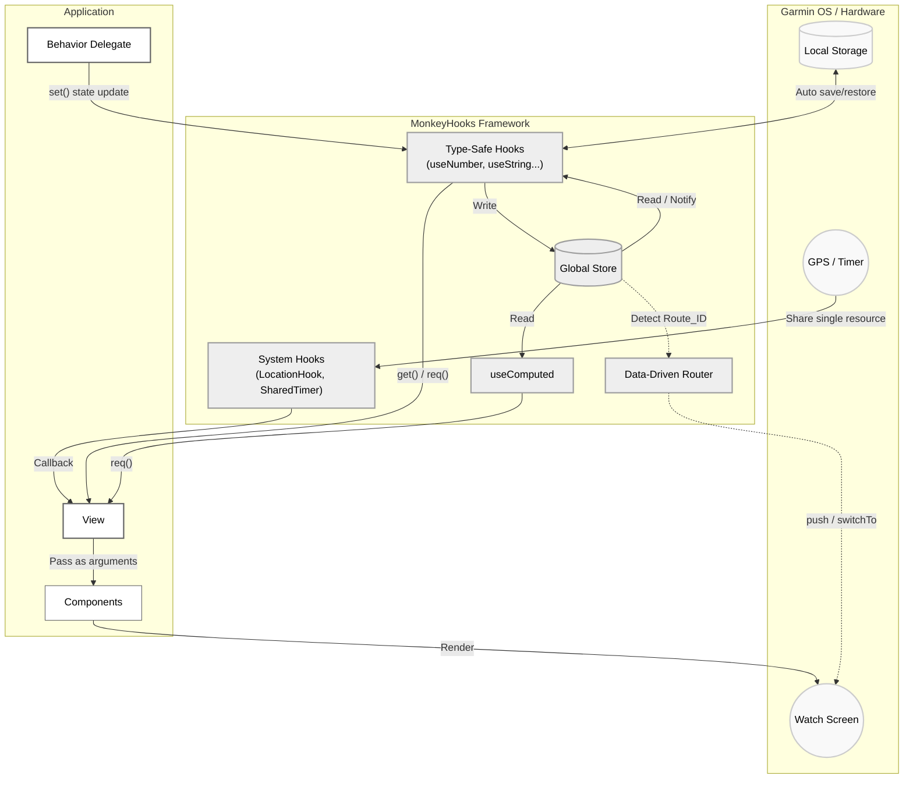

# MonkeyHooks

MonkeyHooks is a library providing state management and utilities for Garmin Connect IQ (Monkey C) application development.

It is designed to improve maintainability by organizing UI state management, the sharing of system resources (such as timers and GPS), and screen transitions.

## Showcase: YAMAKAGE

YAMAKAGE serves as a practical example of what can be built with MonkeyHooks.

[YAMAKAGE(Repository)](https://github.com/tomopumipumi/yamakage)
[YAMAKAGE(Connect IQ)](https://apps.garmin.com/apps/48e48601-9506-4f67-b19c-59ca702c34b8?tid=2)


Implementing complex UIs—such as sun/moon trajectory calculations, panorama views, and animations—under Garmin's strict CPU and memory constraints typically makes it challenging to balance performance with code maintainability.

By utilizing MonkeyHooks' state management and caching mechanisms, YAMAKAGE demonstrates how to keep complex data flows organized and maintainable, while still achieving practical performance (smooth rendering and low battery consumption) on actual devices.

---

## Core Design

MonkeyHooks is designed based on the following paradigms:

1. **Centralized State Management:**
It features a single `Store` shared across the entire application. States are managed by keys and can be accessed and updated from any component.
2. **Automatic Rendering Updates:**
When a state is updated via `set()`, the change is detected, automatically calling `WatchUi.requestUpdate()` and re-evaluating dependent listeners or computed properties.
3. **Type Safety and Null Checking:**
To accommodate the characteristics of Monkey C, it provides type-specific contexts such as `useNumber` and `useString`. By using the `req()` method, you can safely access values assuming they exist (an exception is thrown if the value is null).
4. **Opt-In Design and Resource Sharing:**
It adopts a modular structure (opt-in design), allowing you to include only the necessary features in your project. Additionally, components like `SharedTimer` and `LocationHook` share a single system resource even if referenced by multiple components, using internal weak references (`WeakReference`) to prevent memory leaks.

---

## Architecture



---

## Installation

It is recommended to introduce MonkeyHooks as a Git submodule.

### 1. Adding the Submodule

Run the following command in the root directory of your project to add the library:

```bash
git submodule add https://github.com/tomopumipumi/monkey-hooks.git lib/monkey-hooks

```

### 2. Configuring `monkey.jungle`

Edit the `monkey.jungle` file at the root of your application and add the MonkeyHooks `src` folder to the source path for compilation.

```jungle
project.manifest = manifest.xml

# Add the submodule's src folder in addition to the existing source path
base.sourcePath = source;lib/monkey-hooks/src

```

---

## Recommended Architecture: Props Packing Pattern and Pure Render Functions

To achieve both "smooth rendering performance" and "high testability" on Garmin devices, MonkeyHooks strongly recommends a UI design utilizing the "Props Packing Pattern."

In Monkey C, accessing class instance variables (e.g., `_width` or `_progress`) internally triggers a hash lookup (dictionary lookup). Therefore, frequently accessing member variables inside `onUpdate`—which is called multiple times per second—is a major cause of frame rate drops.

To prevent this, an effective architecture is to pack all the states held by the View into a single "array" and pass it to a stateless "pure function" for rendering.

### Implementation Example

#### **1. Defining Props Indices**

To avoid magic numbers, define the array indices using an `enum` and leave comments indicating their types.

```monkeyc
module MainProps {
    enum {
        W = 0,        // Number
        H,            // Number
        IS_ANIM_ON,   // Boolean
        PROGRESS,     // Float
        DATA_SIZE = 4 // Number of elements in the array
    }
}

```

#### **2. Pure Render Module**

Create a module that is solely responsible for rendering. At the beginning of the function, unpack the received array into local variables. **In Monkey C, accessing local variables is the fastest operation**, so this step alone drastically reduces the rendering overhead.

```monkeyc
module MainRender {
    function render(dc as Graphics.Dc, props as Array) as Void {
        // Unpack into local variables at the beginning
        var w = props[MainProps.W] as Number;
        var h = props[MainProps.H] as Number;
        var isAnimOn = props[MainProps.IS_ANIM_ON] as Boolean;
        var progress = props[MainProps.PROGRESS] as Float;

        dc.setColor(Graphics.COLOR_BLACK, Graphics.COLOR_BLACK);
        dc.clear();
        
        // From here on, use the local variables for rendering
        // ...
    }
}

```

#### **3. View Container**

The `View` class should focus exclusively on "monitoring/updating states" and "packing data." Eliminate all instance variables related to rendering and consolidate them into the `_props` array.

```monkeyc
class MainView extends WatchUi.View {
    // Consolidate all cached data into a single array
    private var _props as Array = new [MainProps.DATA_SIZE];

    function onLayout(dc as Graphics.Dc) as Void {
        _props[MainProps.W] = MonkeyHooks.useNumber(:width).req();
        _props[MainProps.H] = MonkeyHooks.useNumber(:height).req();
    }

    function onTimerTick() as Void {
        if (_props[MainProps.IS_ANIM_ON] as Boolean) {
            _props[MainProps.PROGRESS] = (_props[MainProps.PROGRESS] as Float) + 0.1;
            WatchUi.requestUpdate();
        }
    }

    function onUpdate(dc as Graphics.Dc) as Void {
        // The View simply delegates the state to the render function (no side effects)
        MainRender.render(dc, _props);
    }
}

```

#### Benefits of this Pattern

1. **Performance**: Completely eliminates member variable access (hash lookups) inside the `onUpdate` loop.
2. **Separation of State and Rendering**: Aligns with React's design philosophy (Container / Presentational components), greatly improving the readability of View code that otherwise tends to be cluttered with dozens of variables.
3. **Enabling Headless UI Testing**: By simply passing a dummy array and a dummy `Dc` to `MainRender.render()`, you can run UI crash tests and performance benchmarks without launching the entire system.

---

## Usage

### 1. Basic State Management

Initialize and update states using type-specific hooks (`useNumber`, `useString`, `useBoolean`, etc.).

```monkeyc
class MyDelegate extends WatchUi.BehaviorDelegate {
    private var _counter = MonkeyHooks.useNumber(:counter);

    function onSelect() {
        // Update the state (automatically triggers WatchUi.requestUpdate())
        _counter.set(_counter.req() + 1);
        return true;
    }
}

```

### 2. Subscribing and Rendering State in UI (Push-Based Caching)

**Important:** Due to CPU constraints on Garmin devices, calling `MonkeyHooks.use...` inside `onUpdate` (which runs every frame) causes frame drops (lag) due to dictionary lookup overhead.
**Adopt a "push-based architecture" where states are cached in class variables during `onShow`, and monitored for changes using `watch`.**

```monkeyc
import Toybox.WatchUi;
import Toybox.Graphics;

class MyView extends WatchUi.View {
    // Cache variable for rendering (fastest access)
    private var _currentCount as Number = 0;

    function initialize() {
        View.initialize();
        MonkeyHooks.useNumber(:counter).init(0); // Initialize Store
    }

    function onShow() {
        // 1. Fetch the latest value from the Store on initial display and cache it
        _currentCount = MonkeyHooks.useNumber(:counter).req();

        // 2. Register a listener that fires only when the state changes (push notification)
        MonkeyHooks.watch(self, :onCounterChanged, [:counter]);
    }

    function onHide() {
        // Unregister to prevent memory leaks
        MonkeyHooks.unwatch(self, :onCounterChanged);
    }

    // Called only when the value changes, updating the cache
    function onCounterChanged(vals as Array) as Void {
        if (vals[0] != null) {
            _currentCount = vals[0] as Number;
        }
    }

    function onUpdate(dc) {
        dc.setColor(Graphics.COLOR_WHITE, Graphics.COLOR_BLACK);
        dc.clear();
        
        // Do not call MonkeyHooks inside onUpdate; use only the cached variable
        dc.drawText(100, 100, Graphics.FONT_LARGE, "Count: " + _currentCount, Graphics.TEXT_JUSTIFY_CENTER);
    }
}

```

### 3. Computed Properties (useComputed) ⚠️ Deprecated

Creates derived state that depends on other states. Recalculation occurs only when the dependent states change.

**🚨 Important Performance Warning:**
Under the strict CPU constraints of Garmin devices, it has been proven that the internal "dependency array (deps) change detection loop" performed by `useComputed` introduces non-negligible overhead. Overusing this feature, especially near the render loop (`onUpdate`), is a major cause of frame drops and performance degradation.

**✅ Recommended Alternative (Push-based + Manual Caching):**
For maximum performance, we strongly recommend using `watch` to detect changes in dependent states and manually recalculating and caching the results into class variables within your components. In Monkey C, a simple variable value comparison (dirty checking) acts as the fastest possible "Computed" implementation.

*(Note: This feature is currently deprecated. In line with this framework's design philosophy of pursuing extreme performance, it is scheduled to be removed in a future major version update. Please refrain from using it in new projects and treat it strictly as an optional legacy feature.)*

```monkeyc
class BmiCalculator {
    function calcBmi(deps as Array) as Float {
        var w = deps[0].toFloat();
        var h = deps[1].toFloat() / 100.0;
        return (w / (h * h)).toFloat();
    }
}

var _bmiCalculator = new BmiCalculator();

class UserProfile {
    private var _weight = MonkeyHooks.useNumber(:weight).init(70);
    private var _height = MonkeyHooks.useNumber(:height).init(175);
    
    private var _bmi = MonkeyHooks.useComputed(
        :bmi,
        [:weight, :height],
        _bmiCalculator.method(:calcBmi)
    );

    function printBmi() {
        System.println("BMI: " + _bmi.req());
    }
}

```

### 4. Collection Operations and Forced Updates (forceSet)

Due to Monkey C specifications, arrays and dictionaries are evaluated using reference comparison (`!=`). Modifying the contents of an existing array and calling `set()` will not be detected as a change.
If you manipulate elements directly, use `forceSet()` to bypass the reference comparison and forcibly trigger an update notification and redraw.

```monkeyc
var arrHook = MonkeyHooks.useArray(:myList);
var list = arrHook.req();

list.add("New Item"); // Modifies the array contents (the reference remains the same)

// arrHook.set(list); // Ignored because the reference is identical
arrHook.forceSet(list); // Forcibly triggers an update notification and redraw

```

### 5. Persistent Storage (useStorageString)

Integrates with `Application.Storage` to create states that persist even after the app is closed.

```monkeyc
var userName = MonkeyHooks.useStorageString("username").init("Guest");
userName.set("Bob"); // Store update and Storage.setValue() are executed simultaneously

```

*(※ Do not read/write storage hooks inside `onUpdate` or high-frequency timers. This will shorten flash memory lifespan and cause fatal performance degradation.)*

### 6. Resource Sharing (SharedTimer / LocationHook)

Safely share system resources. The resource activates when the first listener is registered and automatically stops when the number of listeners drops to zero.

```monkeyc
class MainView extends WatchUi.View {
    function onShow() {
        MonkeyHooks.SharedTimer.subscribe(self, :onTick);
        MonkeyHooks.LocationHook.subscribe(self, :onLocationUpdated);
    }

    function onTick() as Void { /* Processing at regular intervals */ }
    function onLocationUpdated(info as Position.Info) as Void { /* GPS processing */ }

    function onHide() {
        MonkeyHooks.SharedTimer.unsubscribe(self, :onTick);
        MonkeyHooks.LocationHook.unsubscribe(self, :onLocationUpdated);
    }
}

```

### 7. Routing (MonkeyRouter)

Manages the instantiation of Views and Delegates to handle screen transitions.

```monkeyc
function onStart(state) {
    MonkeyHooks.Router.initialize(method(:viewFactory));
}

function viewFactory(routeId as Number) as Array? {
    switch(routeId) {
        case 1: return [new HomeView(), new HomeDelegate()];
        case 2: return [new SettingsView(), null];
    }
    return null;
}

// Execute transition
MonkeyHooks.Router.push(1, WatchUi.SLIDE_LEFT);

```

### 8. Testing and Benchmarking (Test Utilities)

MonkeyHooks provides test utilities designed to maximize the benefits of decoupling "pure rendering" from "state management" on Garmin devices.

It enables headless UI rendering tests (smoke/crash detection) and performance benchmarking behind the scenes without having to launch the simulator screen.

#### Basic Test Setup

Access `MonkeyHooks.TestUtils` within your test code to reset the Store, inject mock state, and generate dummy drawing contexts (`Dc`).

#### 1. Resetting the Store and Mocking State

Clean up globally retained state between test cases to prevent state bleeding and inject dummy data for testing.

```monkeyc
import Toybox.Test;

(:test)
function testMyBusinessLogic(logger as Test.Logger) as Boolean {
    // 1. Reset Store to prevent state bleeding between tests
    MonkeyHooks.TestUtils.resetStore();

    // 2. Inject required mock state (does not trigger UI updates)
    MonkeyHooks.TestUtils.injectState({
        :counter => 10,
        "username" => "TestUser"
    });

    // 3. Execute and verify logic
    var counterHook = MonkeyHooks.useNumber(:counter);
    counterHook.set(counterHook.req() + 1);

    Test.assertEqualMessage(counterHook.req(), 11, "Counter should be incremented correctly");
    return true;
}

```

#### 2. Smoke Testing for Pure Render Modules

By passing dummy arguments (`props`) and a dummy canvas (`Dc`) to pure render modules built with the "Props Packing Pattern", you can safely verify that edge cases do not crash or throw unhandled exceptions.

```monkeyc
import Toybox.Test;
import Toybox.Graphics;

(:test)
function testMainRenderDoesNotCrash(logger as Test.Logger) as Boolean {
    // 1. Get a dummy canvas (240x240) provided by the library
    var dc = MonkeyHooks.TestUtils.createDummyDc(240, 240);

    // 2. Create a dummy Props array containing abnormal values or edge cases
    var badProps = new [MainProps.DATA_SIZE];
    badProps[MainProps.W] = 240;
    badProps[MainProps.H] = 240;
    badProps[MainProps.TITLE_FONT] = null; // Case where font failed to load
    badProps[MainProps.PROGRESS] = -999.0; // Abnormal animation value
    // ...

    // 3. Execute rendering and verify it does not crash
    try {
        MainRender.render(dc, badProps);
        logger.debug("Render executed successfully.");
    } catch(e) {
        logger.error("Render crashed: " + e.getErrorMessage());
        return false;
    }

    return true;
}

```

#### 3. UI Render Benchmarking

Automatically measure and verify rendering execution time to ensure compliance with Garmin devices' strict CPU budget (e.g., under 10ms per frame).

```monkeyc
import Toybox.Test;

(:test)
function benchmarkMainRender(logger as Test.Logger) as Boolean {
    var dc = MonkeyHooks.TestUtils.createDummyDc(240, 240);
    var props = [ /* ... valid Props data ... */ ];
    
    // Execute the render function repeatedly (e.g., 100 times) and measure execution time (ms)
    var totalTimeMs = MonkeyHooks.TestUtils.benchmarkRender(
        logger, 
        dc, 
        MainRender.method(:render), 
        props, 
        100, // Number of iterations
        "MainView Render" // Label for logging
    );

    // Require total time for 100 frames to be under 1000ms (<= 10ms per frame)
    Test.assertEqualMessage(totalTimeMs < 1000, true, "Does not meet rendering performance requirements");

    return true;
}

```

---

## 🚨 Best Practices: Maximizing Performance

To maintain smooth animations and rendering on Garmin devices, strictly adhere to the following rules.

### 1. Eliminate MonkeyHooks from inside `onUpdate`

`WatchUi.View.onUpdate()` is an intensive loop called dozens of times per second. Calling `useNumber` or `Store.get` inside this loop causes rendering to lag due to hash lookup overhead.
Always **cache values in class variables during `onLayout` or `onShow**`, and strictly limit `onUpdate` to reading those local variables.

### 2. Do not use Hooks for disposable rendering buffers

Using `MH.usePolygonBuffer` (or similar) to manage temporary array buffers used only momentarily during rendering (like polygon coordinate calculations) incurs lookup costs.
For temporary calculation buffers contained entirely within a single component, reusing a **private static variable of a module** is the fastest approach.

### 3. "Array Packing" for Child Components

When splitting UI components into separate files, calling Hooks within child components degrades performance. The fastest method in Monkey C is to collect static data retrieved in the parent (View)—such as screen dimensions and fonts—into a single array ("array packing") and pass it down as arguments (prop drilling).

```monkeyc
// Create the cache in the parent View's onLayout
_layoutCtx = [displayWidth, titleFont, valueFont];

// Pass it all at once to the child component inside onUpdate
MyComponent.render(dc, _layoutCtx);

```

## License

MIT License
Copyright (c) 2026 Ichimura Tomoo