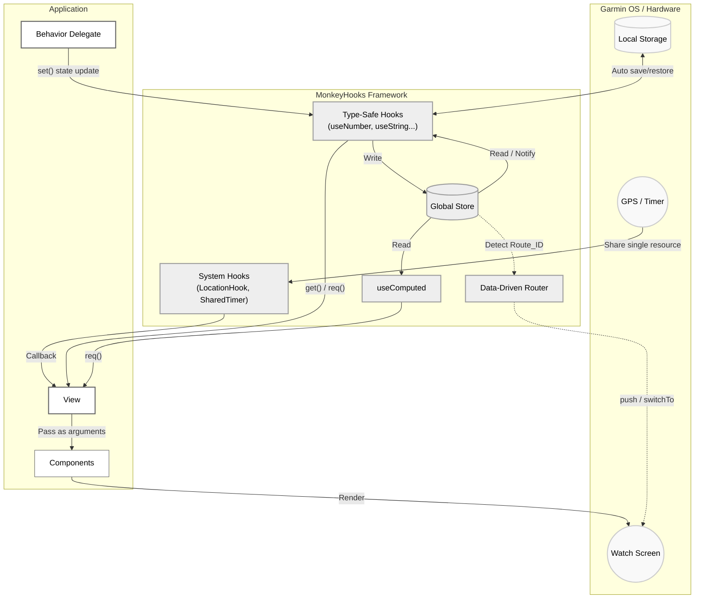

# MonkeyHooks

MonkeyHooks is a library providing state management and utilities for Garmin Connect IQ (Monkey C) application development.

It is designed to improve maintainability by organizing UI state management, the sharing of system resources (such as timers and GPS), and screen transitions.

---

## Core Design

MonkeyHooks is designed based on the following paradigms:

1. **Centralized State Management:**
It features a single `Store` shared across the entire application. States are managed by keys and can be accessed and updated from any component.
2. **Automatic Rendering Updates:**
When a state is updated via `set()`, the change is detected, automatically calling `WatchUi.requestUpdate()` and re-evaluating dependent listeners or computed properties.
3. **Type Safety and Null Checking:**
To accommodate the characteristics of Monkey C, it provides type-specific contexts such as `useNumber` and `useString`. By using the `req()` method, you can safely access values assuming they exist (an exception is thrown if the value is null).
4. **Opt-In Design and Resource Sharing:**
It adopts a modular structure (opt-in design), allowing you to include only the necessary features in your project. Additionally, components like `SharedTimer` and `LocationHook` share a single system resource even if referenced by multiple components, using internal weak references (`WeakReference`) to prevent memory leaks.

---

## Architecture



---

## Installation

It is recommended to introduce MonkeyHooks as a Git submodule.

### 1. Adding the Submodule

Run the following command in the root directory of your project to add the library:

```bash
git submodule add https://github.com/tomopumipumi/monkey-hooks.git lib/monkey-hooks

```

### 2. Configuring `monkey.jungle`

Edit the `monkey.jungle` file at the root of your application and add the MonkeyHooks `src` folder to the source path for compilation.

```jungle
project.manifest = manifest.xml

# Add the submodule's src folder in addition to the existing source path
base.sourcePath = source;lib/monkey-hooks/src

```

---

## Usage

### 1. Basic State Management

Initialize and update states using type-specific hooks (`useNumber`, `useString`, `useBoolean`, etc.).

```monkeyc
class MyDelegate extends WatchUi.BehaviorDelegate {
    private var _counter = MonkeyHooks.useNumber(:counter);

    function onSelect() {
        // Update the state (automatically triggers WatchUi.requestUpdate())
        _counter.set(_counter.req() + 1);
        return true;
    }
}

```

### 2. Subscribing and Rendering State in UI (Push-Based Caching)

**Important:** Due to CPU constraints on Garmin devices, calling `MonkeyHooks.use...` inside `onUpdate` (which runs every frame) causes frame drops (lag) due to dictionary lookup overhead.
**Adopt a "push-based architecture" where states are cached in class variables during `onShow`, and monitored for changes using `watch`.**

```monkeyc
import Toybox.WatchUi;
import Toybox.Graphics;

class MyView extends WatchUi.View {
    // Cache variable for rendering (fastest access)
    private var _currentCount as Number = 0;

    function initialize() {
        View.initialize();
        MonkeyHooks.useNumber(:counter).init(0); // Initialize Store
    }

    function onShow() {
        // 1. Fetch the latest value from the Store on initial display and cache it
        _currentCount = MonkeyHooks.useNumber(:counter).req();

        // 2. Register a listener that fires only when the state changes (push notification)
        MonkeyHooks.watch(self, :onCounterChanged, [:counter]);
    }

    function onHide() {
        // Unregister to prevent memory leaks
        MonkeyHooks.unwatch(self, :onCounterChanged);
    }

    // Called only when the value changes, updating the cache
    function onCounterChanged(vals as Array) as Void {
        if (vals[0] != null) {
            _currentCount = vals[0] as Number;
        }
    }

    function onUpdate(dc) {
        dc.setColor(Graphics.COLOR_WHITE, Graphics.COLOR_BLACK);
        dc.clear();
        
        // Do not call MonkeyHooks inside onUpdate; use only the cached variable
        dc.drawText(100, 100, Graphics.FONT_LARGE, "Count: " + _currentCount, Graphics.TEXT_JUSTIFY_CENTER);
    }
}

```

### 3. Computed Properties (useComputed)

Create derived states that are calculated based on other states. Recalculation occurs only when the dependent states change.

```monkeyc
class BmiCalculator {
    function calcBmi(deps as Array) as Float {
        var w = deps[0].toFloat();
        var h = deps[1].toFloat() / 100.0;
        return (w / (h * h)).toFloat();
    }
}

var _bmiCalculator = new BmiCalculator();

class UserProfile {
    private var _weight = MonkeyHooks.useNumber(:weight).init(70);
    private var _height = MonkeyHooks.useNumber(:height).init(175);
    
    private var _bmi = MonkeyHooks.useComputed(
        :bmi,
        [:weight, :height],
        _bmiCalculator.method(:calcBmi)
    );

    function printBmi() {
        System.println("BMI: " + _bmi.req());
    }
}

```

### 4. Collection Operations and Forced Updates (forceSet)

Due to Monkey C specifications, arrays and dictionaries are evaluated using reference comparison (`!=`). Modifying the contents of an existing array and calling `set()` will not be detected as a change.
If you manipulate elements directly, use `forceSet()` to bypass the reference comparison and forcibly trigger an update notification and redraw.

```monkeyc
var arrHook = MonkeyHooks.useArray(:myList);
var list = arrHook.req();

list.add("New Item"); // Modifies the array contents (the reference remains the same)

// arrHook.set(list); // Ignored because the reference is identical
arrHook.forceSet(list); // Forcibly triggers an update notification and redraw

```

### 5. Persistent Storage (useStorageString)

Integrates with `Application.Storage` to create states that persist even after the app is closed.

```monkeyc
var userName = MonkeyHooks.useStorageString("username").init("Guest");
userName.set("Bob"); // Store update and Storage.setValue() are executed simultaneously

```

*(※ Do not read/write storage hooks inside `onUpdate` or high-frequency timers. This will shorten flash memory lifespan and cause fatal performance degradation.)*

### 6. Resource Sharing (SharedTimer / LocationHook)

Safely share system resources. The resource activates when the first listener is registered and automatically stops when the number of listeners drops to zero.

```monkeyc
class MainView extends WatchUi.View {
    function onShow() {
        MonkeyHooks.SharedTimer.subscribe(self, :onTick);
        MonkeyHooks.LocationHook.subscribe(self, :onLocationUpdated);
    }

    function onTick() as Void { /* Processing at regular intervals */ }
    function onLocationUpdated(info as Position.Info) as Void { /* GPS processing */ }

    function onHide() {
        MonkeyHooks.SharedTimer.unsubscribe(self, :onTick);
        MonkeyHooks.LocationHook.unsubscribe(self, :onLocationUpdated);
    }
}

```

### 7. Routing (MonkeyRouter)

Manages the instantiation of Views and Delegates to handle screen transitions.

```monkeyc
function onStart(state) {
    MonkeyHooks.Router.initialize(method(:viewFactory));
}

function viewFactory(routeId as Number) as Array? {
    switch(routeId) {
        case 1: return [new HomeView(), new HomeDelegate()];
        case 2: return [new SettingsView(), null];
    }
    return null;
}

// Execute transition
MonkeyHooks.Router.push(1, WatchUi.SLIDE_LEFT);

```

---

## 🚨 Best Practices: Maximizing Performance

To maintain smooth animations and rendering on Garmin devices, strictly adhere to the following rules.

### 1. Eliminate MonkeyHooks from inside `onUpdate`

`WatchUi.View.onUpdate()` is an intensive loop called dozens of times per second. Calling `useNumber` or `Store.get` inside this loop causes rendering to lag due to hash lookup overhead.
Always **cache values in class variables during `onLayout` or `onShow**`, and strictly limit `onUpdate` to reading those local variables.

### 2. Do not use Hooks for disposable rendering buffers

Using `MH.usePolygonBuffer` (or similar) to manage temporary array buffers used only momentarily during rendering (like polygon coordinate calculations) incurs lookup costs.
For temporary calculation buffers contained entirely within a single component, reusing a **private static variable of a module** is the fastest approach.

### 3. "Array Packing" for Child Components

When splitting UI components into separate files, calling Hooks within child components degrades performance. The fastest method in Monkey C is to collect static data retrieved in the parent (View)—such as screen dimensions and fonts—into a single array ("array packing") and pass it down as arguments (prop drilling).

```monkeyc
// Create the cache in the parent View's onLayout
_layoutCtx = [displayWidth, titleFont, valueFont];

// Pass it all at once to the child component inside onUpdate
MyComponent.render(dc, _layoutCtx);

```

## License

MIT License
Copyright (c) 2026 Ichimura Tomoo